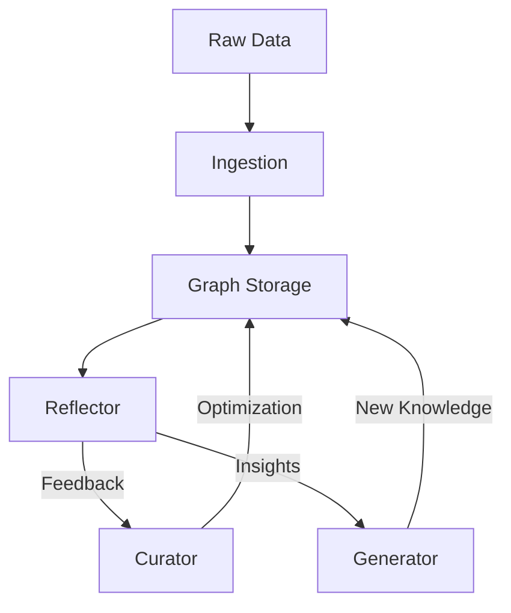

# 🧬 Agentic Context Evolution (ACE) Framework

**ACE** is LightRAG's advanced layer for autonomous graph refinement and context optimization. It transforms a static knowledge graph into an evolving, high-quality retrieval system through agentic loops.

## 🏗️ Core Components

1. **Curator**: responsible for cleaning and deducing missing information in the knowledge graph. It fixes redundant entities and standardizes relationship types.
2. **Reflector**: Monitor's retrieval performance and identifies "low-quality" regions of the graph. It generates feedback for the Curator and Generator.
3. **Generator**: Synthesizes new knowledge or "playbooks" based on the patterns discovered in the graph.
4. **Playbooks**: Dynamic, task-specific instructions that guide the RAG system on how to traverse the graph for specific domains (e.g., "Financial Multi-hop Reasoning").

## 🔄 The ACE Loop

## 🚀 Benefits

- **Autonomous Self-Healing**: Automatically identifies and repairs broken extraction nodes.
- **Contextual Awareness**: Learns the best traversal paths for your specific dataset over time.
- **Reduced Hallucinations**: Continually refines the "facts" stored in the graph for higher precision.

## 🛠️ Usage

ACE components are integrated into the core LightRAG API and can be triggered via specialized endpoints or scheduled background tasks.

---

## 📚 Resources

- [ACE Core Implementation](../lightrag/ace/)
- [SOTA Roadmap](SOTA_ROADMAP.md)
