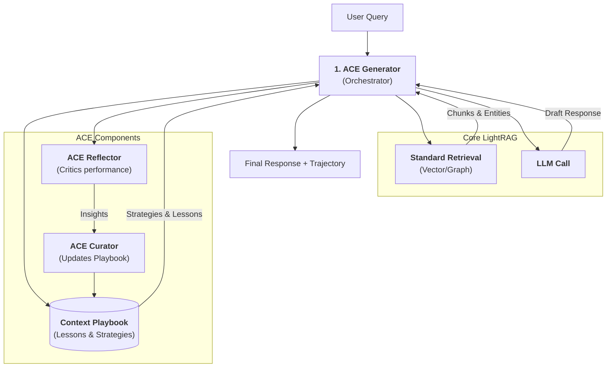

# ACE Framework - Minimal Prototype

## Overview
The **Agentic Context Evolution (ACE)** Framework is an architectural overlay that wraps LightRAG's existing retrieval and generation pipeline. It introduces a **feedback loop** that allows the system to learn from its own performance through a persistent "Context Playbook".

## Architecture
ACE operates as a "Context-First" system, prioritizing agent-learned strategies alongside raw data retrieval.

### The Feedback Loop
The system follows a continuous Generate-Reflect-Curate (GRC) loop:



### Component Interaction
1.  **Generate**: The `ACEGenerator` queries the `Context Playbook` for directives, combines them with retrieved data from `LightRAG`, and produces a response.
2.  **Reflect**: The `ACEReflector` analyzes the `Trajectory` (the reasoning steps) and identifies 1-3 key insights or failures.
3.  **Curate**: The `ACECurator` synthesizes these insights into the `Context Playbook`, updating the system's "memory" for the next interaction.

## Technical Integration
ACE is fully integrated into the main `LightRAG` class and exposed via the FastAPI server.

-   **Initialization**: Managed in `LightRAG.__post_init__` when `enable_ace=True`.
-   **API**: Accessed via `POST /ace/query`.
-   **CLI**: Enabled using the `--enable-ace` flag or `ENABLE_ACE=True` environment variable.
-   **Storage**: ACE state is persisted in `working_dir/ace_data/context_playbook.json`.

## Implementation Details

### File Structure
The implementation is located in `lightrag/ace/`:

-   `config.py`: Configuration and paths.
-   `playbook.py`: Manages the persistent JSON state (`context_playbook.json`) and renders it for the LLM.
-   `generator.py`: Wraps `LightRAG.aquery_data` to inject context and playbook into the system prompt.
-   `reflector.py`: Uses the LLM to critique the response and output a list of insights.
-   `curator.py`: Takes insights and appends them to the Playbook's "Lessons Learned".

### Components

#### 1. Context Playbook (`playbook.py`)
-   **State**: Stored in `ace_data/context_playbook.json`.
-   **Content**:
    -   `Core Directives`: Immutable high-level goals.
    -   `Strategies`: Mutable naming/description pairs of operational strategies.
    -   `Lessons Learned`: Append-only list of insights from past runs.
-   **Function**: `render()` creates a markdown string for insertion into the LLM context.

#### 2. Generator (`generator.py`)
-   **Input**: User query.
-   **Action**:
    1.  Calls `LightRAG.aquery_data()` to get entities/relations (without generating an answer).
    2.  Formats the retrieved context.
    3.  Renders the `Context Playbook`.
    4.  Constructs a system prompt combining Playbook + Context.
    5.  Calls the configured LLM to generate the final response.
-   **Output**: Response string + Trajectory metadata.

#### 3. Reflector (`reflector.py`)
-   **Input**: Query + Generator's Response.
-   **Action**: Asks the LLM to critique the quality/accuracy and extract 1-3 concrete lessons.
-   **Output**: List of strings (Insights).

#### 4. Curator (`curator.py`)
-   **Input**: Insights from Reflector.
-   **Action**: Appends insights to the Playbook's `lessons_learned` list and saves to disk.
-   **Future Work**: Intelligent deduplication and strategy merging.

## Verification
A test suite `tests/test_ace_components.py` verifies the components:

-   `test_playbook_persistence`: Ensures lessons are saved/loaded correctly.
-   `test_playbook_render`: Checks markdown formatting.
-   `test_generator_flow`: Mocks retrieval/LLM to verify the playbook is injected into the prompt.
-   `test_reflector_flow`: Verifies parsing of LLM insight output.
-   `test_curator_flow`: Verifies insights result in playbook updates.

## Usage Example
```python
from lightrag.lightrag import LightRAG
from lightrag.ace.config import ACEConfig
from lightrag.ace.playbook import ContextPlaybook
from lightrag.ace.generator import ACEGenerator

# Initialize
rag = LightRAG(...)
config = ACEConfig()
playbook = ContextPlaybook(config)
generator = ACEGenerator(rag, playbook)

# Run Query
result = await generator.generate("What is the status of project X?")
print(result["response"])
```
